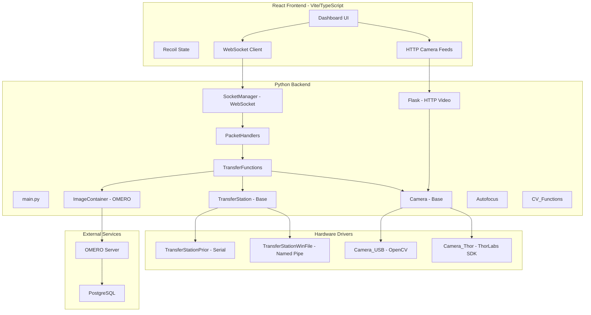

# Comprehensive Code Review: Automated Transfer Station

## Current Architecture Overview



The project has a solid conceptual split: a Python runtime that manages hardware (cameras + transfer stations) and exposes capabilities over WebSocket + HTTP, and a React UI that connects to it. The factory pattern for both cameras and transfer stations is a good start for multi-hardware support. Below are the key findings and recommended improvements, roughly ordered by impact.---

## A. Critical Architectural Issues

### A1. Pervasive Static/Class-Level State Instead of Dependency Injection

Almost every major class stores its core state as class-level attributes rather than instance attributes passed via constructor:

- `Camera.global_list`, `Camera.image_container` ([src/camera.py](src/camera.py) L17-18)
- `Transfer_Station.subclass_instances` ([src/transfer_station.py](src/transfer_station.py) L8)
- `PacketHandlers.transfer_station`, `PacketHandlers.image_container` ([src/packet_handlers.py](src/packet_handlers.py) L27-28)
- `Transfer_Functions.execute`, `Transfer_Functions.executing_threads` ([src/transfer_functions.py](src/transfer_functions.py) L27-28)
- `Logger.socket_manager`, `Logger.messages` ([src/logger.py](src/logger.py) L7)

**Why it matters:** This makes every component a de facto global singleton, creates hidden coupling, and makes testing/mocking impossible. It also means you can never run two independent transfer station sessions in the same process (relevant for future multi-station setups).**Recommendation:** Create a central `Runtime` or `AppContext` class that owns all the instances and pass them via constructor injection:

```python
class Runtime:
    def __init__(self, config: AppConfig):
        self.logger = Logger(...)
        self.image_store = ImageStore.create(config.image_backend)
        self.transfer_station = TransferStation.create(config.station_type)
        self.cameras = CameraManager(config.camera_type)
        self.transfer_functions = TransferFunctions(
            self.transfer_station, self.cameras, self.image_store
        )
```


### A2. No Proper Abstract Base Classes

[`Transfer_Station`](src/transfer_station.py) and [`Camera`](src/camera.py) use "virtual" methods that silently do nothing or log, rather than Python's `abc.ABC` + `@abstractmethod`. This means a subclass can silently forget to implement a critical method (like `moveXRel`) and the base class will just pretend it worked.**Recommendation:** Use `abc.ABC`:

```python
from abc import ABC, abstractmethod

class TransferStation(ABC):
    @abstractmethod
    def move_x(self, x: float) -> None: ...
    
    @abstractmethod
    def move_y(self, y: float) -> None: ...
    
    @abstractmethod
    def pos_x(self) -> float: ...
```


### A3. OMERO as Mandatory Dependency is Too Rigid

[`Image_Container.__init__`](src/image_container.py) (L25-29) always tries to connect to OMERO. If OMERO is not running, the entire system crashes at startup. For a library meant to work in "tons of different hardware configurations," image storage needs to be pluggable.**Recommendation:** Create an `ImageStore` interface with at least two backends:

- `OmeroImageStore` -- the current OMERO implementation
- `LocalFileImageStore` -- saves to disk with JSON metadata (zero infrastructure needed)
- `NullImageStore` -- for testing or when you don't want to save images

### A4. Thread Safety Issues

Several critical variables are shared across threads without synchronization:

- `Transfer_Functions.execute` is a bare `bool` used for pause/cancel across threads ([src/transfer_functions.py](src/transfer_functions.py) L28, L59-67). Should be a `threading.Event`.
- Camera FPS counters (`frame_count`, `fps_update_time`) are read/written from the capture thread and the main thread without locks ([src/camera.py](src/camera.py) L134-141).
- `Socket_Manager.CONNECTIONS` is a `set` modified in async context but potentially read synchronously ([src/socket_manager.py](src/socket_manager.py) L19).

**Recommendation:** Use `threading.Event` for cancellation, add locks around shared counters, and use `asyncio`-safe collections for the connection set.

### A5. Mixed Async/Sync Communication Pattern

`Socket_Manager` runs an asyncio event loop in a background thread ([src/socket_manager.py](src/socket_manager.py) L29-39), then `send_all_json` (L90-100) tries to schedule tasks on that loop from any thread using `loop.call_soon_threadsafe`. But it first tries `asyncio.get_event_loop()` which may return a *different* loop if called from a non-asyncio thread, leading to silent failures.**Recommendation:** Store the running loop as a class attribute when the server starts, and always use `loop.call_soon_threadsafe(asyncio.ensure_future, coro)` against that specific loop reference.---

## B. Code Quality Issues

### B1. Naming Bugs and Inconsistencies

- **`defualt.env`** ([src/defualt.env](src/defualt.env)) -- typo ("default")
- **`send_command_history`** is both a method and an instance variable in `Transfer_Station` ([src/transfer_station.py](src/transfer_station.py) L26 and L123) -- the method shadows the attribute
- **`led_off`** is defined twice ([src/transfer_station.py](src/transfer_station.py) L101 and L104)
- **Mixed naming conventions**: `Camera_USB` vs `TransferStationPrior`, `moveXRel` vs `move_x_rel`
- **`TransferStationWinFile.moveX`** calls `self.send_command(cmd)` ([src/transferStations/transfer_station_winFile.py](src/transferStations/transfer_station_winFile.py) L50) but there's no `send_command` on the base class (it's in `Transfer_Functions` at line 385)

**Recommendation:** Adopt PEP 8 consistently (`snake_case` for methods), fix all naming collisions, and run a linter.

### B2. Broken Handler

`handle_request_log_messages` ([src/packet_handlers.py](src/packet_handlers.py) L135-140) references `self.logger` but these handlers are effectively `@classmethod` -- `self` refers to `packet_type` due to the decorator. This will crash if ever called.

### B3. Dead and Commented-Out Code

- `auto_focus2` ([src/transfer_functions.py](src/transfer_functions.py) L274-291) is abandoned
- `generate_brightness_line` ([src/cv_functions.py](src/cv_functions.py) L83-86) calls bare `line_rgb_values` instead of `CV_Functions.line_rgb_values`
- `CV_Functions.matGMM2DTransform` is commented out in camera.py L179
- Many `# print(...)` and `# Logger.log(...)` statements throughout

---

## C. Missing Capabilities

### C1. No Plugin/Driver Registry

Adding a new transfer station or camera type requires modifying the factory method in the base class. For a "general purpose library," you need a registration system:

```python
# In a driver file:
@TransferStation.register("prior")
class TransferStationPrior(TransferStation):
    ...

# The factory method just does a lookup:
@classmethod
def create(cls, station_type: str):
    driver_cls = cls._registry.get(station_type)
    if not driver_cls:
        raise ValueError(f"Unknown station type: {station_type}")
    return driver_cls()
```

This lets users add new hardware support without modifying core code.

### C2. No Configuration Validation

There is no schema validation anywhere:

- Incoming WebSocket packets are not validated beyond `packet["type"]`
- Transfer function parameters are not type-checked
- Environment variables have no validation (e.g., `CAMERA_INIT_TIMEOUT` is used with `os.getenv` which returns a string, but it's passed to `time.sleep` which expects a number -- [src/camera.py](src/camera.py) L97)

**Recommendation:** Use `pydantic` for configuration models and packet validation.

### C3. Flake Detection Not Integrated

The flake detection pipeline ([TestingEnv/CVTesting/FlakeDetection/detect_flakes.py](TestingEnv/CVTesting/FlakeDetection/detect_flakes.py)) is well-structured with clean dataclasses, but it lives in the testing directory and is not wired into the main runtime. There's also the vendored [2DMatGMM](2DMatGMM/) and [Flinder](Flinder/) directories that appear to be reference implementations.**Recommendation:** Move `detect_flakes.py` into `src/` as a proper module, create a `FlakeDetector` interface so different detection backends (your LAB-based detector, the GMM detector, future ML models) can be swapped in.

### C4. No Proper Task/Operation State Machine

Complex operations like trace-over ([src/transfer_functions.py](src/transfer_functions.py) L72-179) run in bare threads with a boolean flag for pause/cancel. There's no:

- Operation progress reporting
- Proper cancellation with cleanup
- Operation queuing (what happens if you send two trace-over commands?)
- State machine (idle -> running -> paused -> cancelled -> completed)

**Recommendation:** Create an `OperationRunner` with a proper state machine, progress callbacks, and a task queue.

### C5. No Test Suite

There are no unit or integration tests for the core runtime. The only test infrastructure is `test_suite.py` for flake detection. For a library meant to be robust and general-purpose, this is a significant gap.

### C6. No Proper Package Structure

The project is not installable as a Python package -- `src/` has no `__init__.py`, no `setup.py` or `pyproject.toml`. This makes it hard to import modules cleanly and impossible to distribute.---

## D. Frontend Issues

### D1. CustomEvent-Based Cross-Component Communication

Position updates and camera refresh events use `window.dispatchEvent(new CustomEvent(...))` ([src/packets/PacketHandlers.ts](client/src/packets/PacketHandlers.ts) L59-63, [src/hooks/usePositionPolling.ts](client/src/hooks/usePositionPolling.ts) L104-113). This bypasses React's data flow model and Recoil's state management entirely.**Recommendation:** Have `PacketHandlers` update Recoil atoms directly (using a `RecoilCallback` pattern or a shared setter reference), rather than dispatching DOM events.

### D2. Incomplete State Migration

As documented in [DATA_CENTRIC_ARCHITECTURE.md](DATA_CENTRIC_ARCHITECTURE.md), several components still use local state that should be centralized. Legacy state files (`jsonState.ts`, `hostState.ts`, `consoleState.ts`) are still in use alongside the new `appState.ts`.

### D3. Recoil is Deprecated

Recoil has been effectively abandoned by Meta (no releases since mid-2023, archived status). For a new project, consider migrating to `Zustand` or `Jotai` which are actively maintained and have similar atom-based APIs.---

## E. Recommended Improvement Roadmap

This is ordered by priority -- fix foundations first, then add features:| Priority | Item | Impact ||----------|------|--------|| 1 | Fix broken code (naming collisions, broken handlers, env var types) | Prevents runtime crashes || 2 | Introduce `abc.ABC` for TransferStation and Camera base classes | Catches missing implementations at class definition time || 3 | Create pluggable ImageStore with local-file fallback | System can start without OMERO || 4 | Introduce proper DI / `Runtime` context object | Removes hidden global state || 5 | Fix thread safety (Events for cancellation, locks for shared state) | Prevents race conditions || 6 | Add driver registry for hardware plugins | New hardware without modifying core || 7 | Add pydantic config/packet validation | Prevents silent misconfigurations || 8 | Create proper Python package structure | Enables clean imports and distribution || 9 | Integrate flake detection into main pipeline | Core feature currently disconnected || 10 | Build operation state machine / task queue | Reliable complex operations || 11 | Add unit test infrastructure | Confidence in changes || 12 | Frontend: eliminate CustomEvents, complete state migration | Clean data flow || 13 | Frontend: evaluate Recoil replacement | Long-term maintainability |---

## F. What's Good

To be clear, there is a lot of solid work here:

- **Factory pattern** for cameras and transfer stations is the right approach
- **Decorator-based handler registration** in both packet_handlers and transfer_functions is clean
- **The detect_flakes.py module** is well-structured with proper dataclasses and clean separation
- **OMERO integration** for scientific image management is a thoughtful choice for a research lab