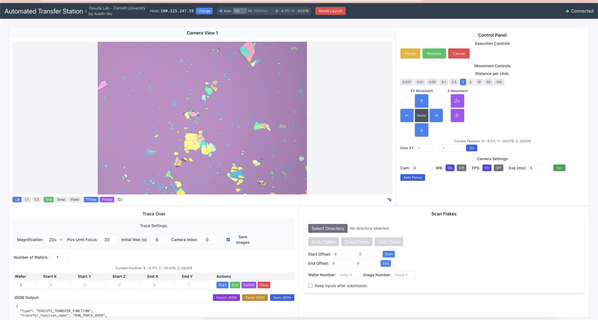

# Automated Transfer Program

## Overview
This platform, developed by Austin Wu for the Yasuda Lab at Cornell, is designed for 2D material automation. It provides:
- Interface capabilities with various stations
- Flake searching functionality
- Potential automated stacking algorithms
- Automated station control



## How to use
After installation, define wafers to scan over. Then trace over them and after compute where flakes are.

## Prerequisites
- [Miniconda](https://docs.conda.io/en/latest/miniconda.html) (Make sure it's installed and added to your PATH)
- Python 3.11.9
- Node.js and npm (for the client application)

## Installation

### 1. Set up the Python Environment
If on windows, ensure powershell is connected to conda porperly. You should see a `(base) PATH` before any command
```bash
# Create and activate a new conda environment
conda create -n automatedTransfer python=3.11.9
conda activate automatedTransfer

# Install dependencies
cd /path/to/project
pip install -r requirements.txt
conda install -n automatedTransfer -c conda-forge omero-py --no-update-deps # must use conda
pip install ".\thorlabs_tsi_camera_python_sdk_package.zip" # must use zip
```

Also ensure the proper dlls are inside of `src/cameras/thor_drivers/` if you are using the thorcam. You can find more resournces at `C:\Program Files\Thorlabs\Scientific Imaging\Scientific Camera Support`

### 2. Install Software
The project requires the [2DMatGMM](https://github.com/Austin4705/2DMatGMM) library as a submodule. Either use the submoudle recurisve or git clone it. Note please use my forked version.
```bash
# From the project root directory
git submodule update --init --recursive
git clone https://github.com/Austin4705/2DMatGMM

pip install -e 2DMatGMM
```

### Run
I have created a file in the main directory `launch.bat`. By clicking it and running it all remaining things should either install or boot up.

### Manually start up Program
#### If that doesnt work, you'll need to do this to run it:

This project also uses OMERO for storing microscope data. To install, simply run 
```bash
dokcer compose pull
```
once in this directory to install it. 
### 3. To Launch The Application
You will need to run three terminals to start up the app. Do the windows ones in powershell. Assume you open the terminal in this directory.
#### First Terminal
```bash
docker compose up -d
```
To run it on initalization ensure docker desktop is running in the background before running. If you want to view data, login at `http://localhost:4080/` with usrname:password `root:omero`
#### Second Terminal
``` bash
cd client
npm install
```
#### Third Terminal
```bash
conda activate automatedTransfer
cd src
python main.py

# Or use the shorthand command
conda activate automatedTransfer && cd src && python main.py

#Alternatively for windows you can run 
.\run.bat
```

### 4. Configure Specifci Environment 
Create a `.env` file based on `default.env` in the project src directory with the following things:
- Transfer Station
    - Prior
    - Winfile
- Microscope:
    - Prior
    - usb

### 5. Notes 
- Now if you are using a hq graphene transfer station, do a couple things. Ensure the software is updated to the latest version, it should have the latest version of the command server. Ensure that [the imaging source drivers](https://www.theimagingsource.com/en-us/support/download/icwdmuvccamtis33u-5.3.0.2793/)are properly installed
- If on a hq graphene system ensure that the software is started and then goto file -> run command server 
- Adjust the port values according to your setup.
- Well also need to install PYVisa. You can do this at the ni website it is free you just have to make an account
- You can make drivers to get other control platforms to work. Simply create a new inherited class and fill in the functions as needed. For debugging, there are vritual ones that do nothing
- If you encounter Conda-related issues on Windows (WSL is recommended instead):
```powershell
Set-ExecutionPolicy Unrestricted
conda init powershell
```
### Previously Useful Commands
```json
{
  "type": "EXECUTE_TRANSFER_FUNCTION",
  "data": {
    "transfer_function_name": "SET_EXPOSURE_TIME",
    "parameters": "[{\"camera_index\": 0, \"exposure_time_us\": 5000}]"
  }
}
```

## Contributing
For questions or contributions, please contact the Yasuda Lab at Cornell or Austin at `austin-wu.com`

## License
Creative Commons BY-NC